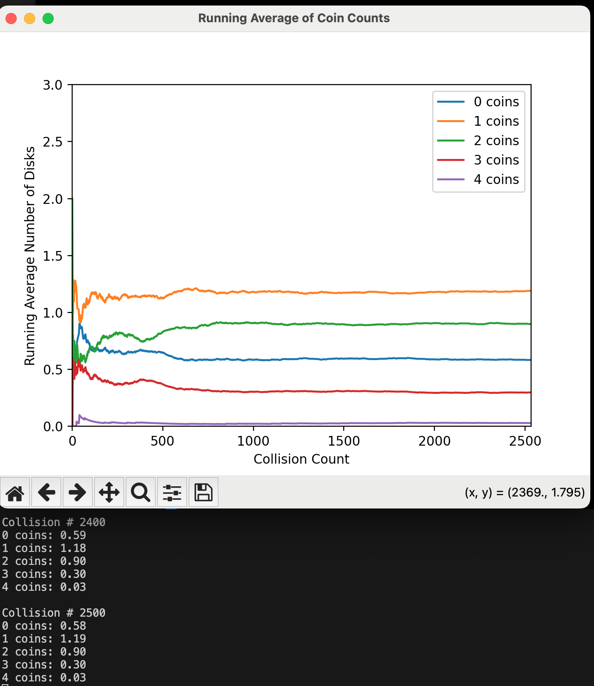

```markdown
# Asymmetrical Coin Exchange Algorithm (Original Implementation)

This document describes the original coin exchange algorithm used in the simulation. **The interaction is asymmetrical** because the order in which disks are processed affects the outcome of the energy exchange. This asymmetry leads to deviations from the theoretical Boltzmann distribution, particularly in the dominance of `n(E_1)` over `n(E_0)`.

---

## Interaction Logic

### Key Steps:
1. **Disk1's coins are processed first**:  
   For each coin in Disk1, there is a 50% chance it will move to Disk2.  
   These transferred coins are immediately added to Disk2's count.  

2. **Disk2's coins are processed second**:  
   For each coin in Disk2 (including those just received from Disk1), there is a 50% chance it will move to Disk1.  

This creates an asymmetry: Disk2's coin transfers are influenced by the coins it received from Disk1 earlier in the same interaction.

---

## Code Snippet: Asymmetrical Implementation

```python
# --- Coin exchange (original asymmetrical version) ---
total_coins_disk1 = disk1.coin_count
total_coins_disk2 = disk2.coin_count

# For disk1's coins:
coins_moving_to_disk2 = 0
for _ in range(total_coins_disk1):
    if random.random() < 0.5:
        coins_moving_to_disk2 += 1
disk1.coin_count -= coins_moving_to_disk2
disk2.coin_count += coins_moving_to_disk2  # Disk2 updated FIRST

# For disk2's coins:
coins_moving_to_disk1 = 0
for _ in range(total_coins_disk2):
    if random.random() < 0.5:
        coins_moving_to_disk1 += 1
disk2.coin_count -= coins_moving_to_disk1
disk1.coin_count += coins_moving_to_disk1  # Disk1 updated SECOND
```

---

## Why This is Asymmetrical

- **Order Dependency**:  
  Disk2 receives coins from Disk1 **before** its own coins are processed.  
  Example:  
  - Disk1 starts with 2 coins, Disk2 with 0.  
  - If Disk1 transfers 1 coin to Disk2, Disk2 now has 1 coin to process.  
  - Disk2 then has a 50% chance to return that new coin to Disk1.  

- **Physical Unrealism**:  
  Energy exchange should not depend on which disk is labeled "Disk1" or "Disk2" in the code. The outcome becomes sensitive to the order of operations.

---

## Example: 3 Disks and 4 Coins

### Theoretical Results
For a system with **3 disks** and **4 coins**, the expected average number of disks with each energy level (`n(E_i)`) is:
- `n(E_0) ≈ 1.0`
- `n(E_1) ≈ 0.8`
- `n(E_2) ≈ 0.6`
- `n(E_3) ≈ 0.4`
- `n(E_4) ≈ 0.2`

These values are derived from the Boltzmann distribution and represent the equilibrium state of the system.

---

### Simulation Results
The simulation using the **Asymmetrical Coin Exchange Algorithm** does not align with the theoretical predictions. Below is a plot showing the convergence of the simulation over time:



#### Key Observations:
- **Deviation from Theory**: The simulation does not converge to the expected Boltzmann distribution. Specifically:
  - `n(E_1)` dominates, becoming the largest value, while `n(E_0)` is smaller than expected.
  - This suggests that the asymmetrical algorithm introduces significant bias in the energy exchange process.

#### Example Output:
At **Collision # 2369**, the average number of disks with each energy level is:
- `0 coins: 0.57`
- `1 coins: 1.79`
- `2 coins: 0.88`
- `3 coins: 0.29`
- `4 coins: 0.03`

These results show that `n(E_1)` is significantly larger than `n(E_0)`, which contradicts the theoretical prediction that `n(E_0)` should be the largest.

---

## Summary of Key Features

| Feature | Description |
|---------|-------------|
| **Order Dependency** | The outcome depends on the order in which disks are processed. |
| **Physical Unrealism** | The exchange is not physically realistic due to asymmetry. |
| **Convergence** | Does not align with the Boltzmann distribution. |

---

## Comparison with Theoretical Values

| Energy Level | Theoretical (`n(E_i)`) | Simulation (`n(E_i)`) | Deviation |
|--------------|------------------------|-----------------------|-----------|
| `E_0`        | 1.0                    | 0.57                  | -0.43     |
| `E_1`        | 0.8                    | 1.79                  | +0.99     |
| `E_2`        | 0.6                    | 0.88                  | +0.28     |
| `E_3`        | 0.4                    | 0.29                  | -0.11     |
| `E_4`        | 0.2                    | 0.03                  | -0.17     |

---

## Conclusion

The **Asymmetrical Coin Exchange Algorithm** introduces significant bias due to its order dependency, leading to deviations from the theoretical Boltzmann distribution. The dominance of `n(E_1)` over `n(E_0)` highlights the need for a more robust exchange mechanism, such as the **Uniform Probability Redistribution Algorithm**, which aligns closely with theoretical predictions.
```
