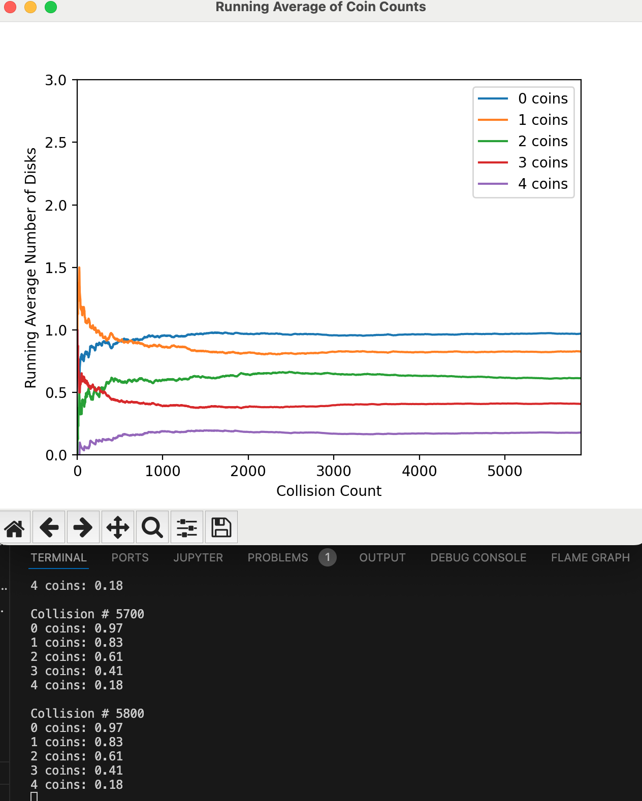
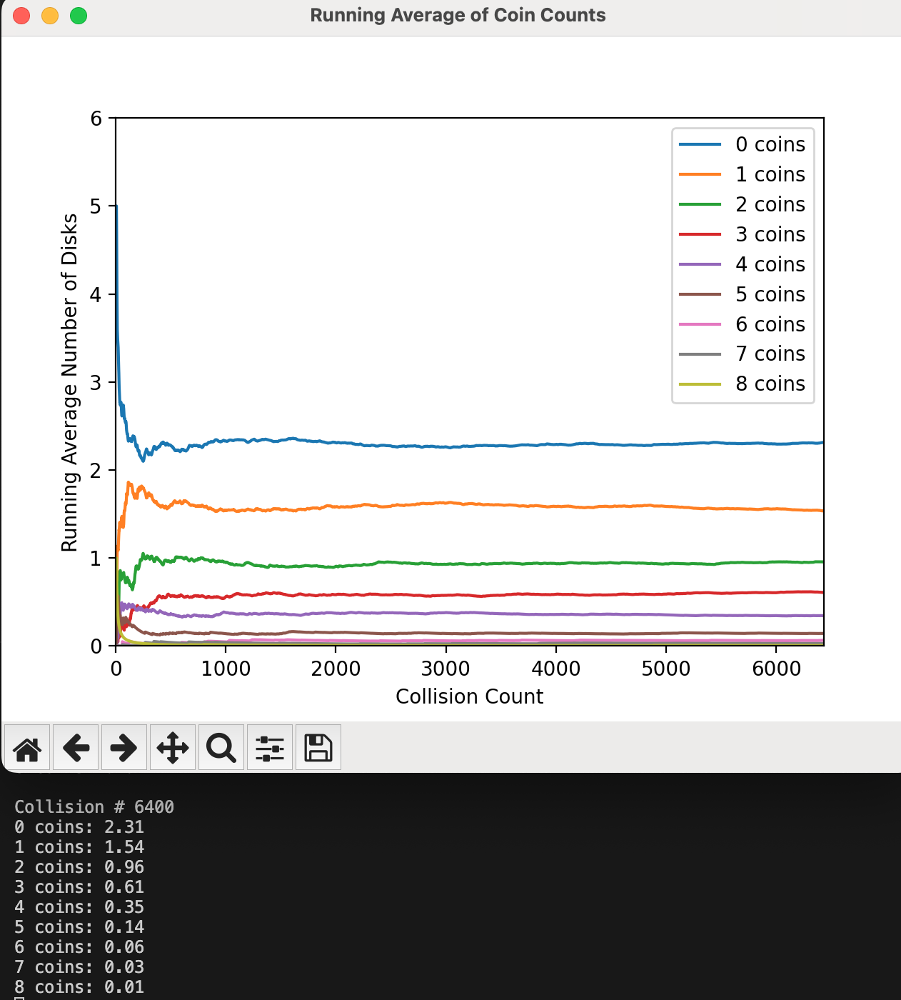

# Uniform Probability Redistribution Algorithm

This document describes the **Uniform Probability Redistribution Algorithm** used in the simulation. Unlike the previous approaches, this algorithm ensures that all possible energy redistributions between two disks are equally likely during a collision. This approach eliminates any bias introduced by the order of processing and ensures that the system evolves toward the correct Boltzmann distribution.

---

## Interaction Logic

### Key Steps:
1. **Calculate Total Energy**:  
   - The total energy (coins) of the two disks is calculated as `total_coins = disk1.coin_count + disk2.coin_count`.

2. **Generate All Possible Redistributions**:  
   - All valid ways to redistribute the total energy between the two disks are generated.  
   - A redistribution is valid if neither disk exceeds the maximum allowed coins (`MAX_COINS_PER_DISK`).

3. **Randomly Select a Redistribution**:  
   - One of the possible redistributions is selected with **uniform probability**.

4. **Apply the Selected Redistribution**:  
   - The selected redistribution is applied to the two disks, updating their coin counts.

---

## Code Snippet: Uniform Probability Redistribution

```python
def handle_disk_collision(disk1, disk2):
    """
    Check if disks collide. If they do, perform elastic collision and coin exchange.
    Returns True if a collision actually happened, otherwise False.
    """
    dist = distance(disk1, disk2)
    if dist < disk1.radius + disk2.radius:
        # Avoid division by zero by adding a small epsilon
        dist = max(dist, EPSILON)

        # --- Simple elastic collision for equal masses ---
        nx = (disk2.x - disk1.x) / dist
        ny = (disk2.y - disk1.y) / dist
        v1n = disk1.vx * nx + disk1.vy * ny
        v2n = disk2.vx * nx + disk2.vy * ny

        disk1.vx += (v2n - v1n) * nx
        disk1.vy += (v2n - v1n) * ny
        disk2.vx += (v1n - v2n) * nx
        disk2.vy += (v1n - v2n) * ny

        # --- Uniform probability coin exchange ---
        total_coins = disk1.coin_count + disk2.coin_count

        # Generate all possible redistributions of coins between the two disks
        possible_redistributions = []
        for coins_in_disk1 in range(total_coins + 1):
            coins_in_disk2 = total_coins - coins_in_disk1
            if coins_in_disk1 <= MAX_COINS_PER_DISK and coins_in_disk2 <= MAX_COINS_PER_DISK:
                possible_redistributions.append((coins_in_disk1, coins_in_disk2))

        # Randomly select one of the possible redistributions
        selected_redistribution = random.choice(possible_redistributions)

        # Apply the selected redistribution
        disk1.coin_count, disk2.coin_count = selected_redistribution

        return True
    return False
```

---

## Why This Works

- **Uniform Probability**:  
  Every possible energy distribution between the two disks is equally likely, ensuring no bias in the exchange process.

- **Correct Boltzmann Distribution**:  
  Over time, the system evolves toward the expected Boltzmann distribution because the exchange mechanism is unbiased and physically realistic.

- **No Order Dependency**:  
  The outcome of the exchange does not depend on the order in which the disks are processed.

---

## Example 1: 3 Disks and 4 Coins

### Theoretical Results
For a system with **3 disks** and **4 coins**, the expected average number of disks with each energy level (`n(E_i)`) is:
- `n(E_0) ≈ 1.0`
- `n(E_1) ≈ 0.8`
- `n(E_2) ≈ 0.6`
- `n(E_3) ≈ 0.4`
- `n(E_4) ≈ 0.2`

These values are derived from the Boltzmann distribution and represent the equilibrium state of the system.

---

### Simulation Results
The simulation using the **Uniform Probability Redistribution Algorithm** closely aligns with the theoretical predictions. Below is a plot showing the convergence of the simulation over time:



#### Key Observations:
- **Convergence**: The simulation converges to the expected values after a sufficient number of collisions.
- **Stability**: The values remain stable around the theoretical predictions as the collision count increases.

#### Example Output:
At **Collision # 5800**, the average number of disks with each energy level is:
- `0 coins: 0.97`
- `1 coins: 0.83`
- `2 coins: 0.61`
- `3 coins: 0.41`
- `4 coins: 0.18`

These results are very close to the theoretical values, demonstrating the effectiveness of the algorithm.

---

## Example 2: 6 Disks and 8 Coins

### Theoretical Results
For a system with **6 disks** and **8 coins**, the expected average number of disks with each energy level (`n(E_i)`) is derived from the Boltzmann distribution. The theoretical values are:

| Energy Level | Theoretical (`n(E_i)`) |
|--------------|------------------------|
| `E_0`        | 2.31                  |
| `E_1`        | 1.54                  |
| `E_2`        | 0.98                  |
| `E_3`        | 0.59                  |
| `E_4`        | 0.33                  |
| `E_5`        | 0.16                  |
| `E_6`        | 0.07                  |
| `E_7`        | 0.02                  |
| `E_8`        | 0.00                  |

These values are calculated based on the number of microstates and their probabilities, as shown in the full macrostate table below:

---

### Full Macrostate Table for 6 Disks and 8 Coins

| Macrostate | 0ΔE | 1ΔE | 2ΔE | 3ΔE | 4ΔE | 5ΔE | 6ΔE | 7ΔE | 8ΔE | Number of Microstates | Probability (`P_i`) |
|------------|-----|-----|-----|-----|-----|-----|-----|-----|-----|-----------------------|---------------------|
| 1          | 5.0 | 0.0 | 0.0 | 0.0 | 0.0 | 0.0 | 0.0 | 0.0 | 1.0 | 6.0                   | 0.004662            |
| 2          | 4.0 | 1.0 | 0.0 | 0.0 | 0.0 | 0.0 | 0.0 | 1.0 | 0.0 | 30.0                  | 0.02331             |
| 3          | 4.0 | 0.0 | 1.0 | 0.0 | 0.0 | 0.0 | 1.0 | 0.0 | 0.0 | 30.0                  | 0.02331             |
| 4          | 4.0 | 0.0 | 0.0 | 1.0 | 0.0 | 1.0 | 0.0 | 0.0 | 0.0 | 30.0                  | 0.02331             |
| 5          | 4.0 | 0.0 | 0.0 | 0.0 | 2.0 | 0.0 | 0.0 | 0.0 | 0.0 | 15.0                  | 0.011655            |
| 6          | 3.0 | 2.0 | 0.0 | 0.0 | 0.0 | 0.0 | 1.0 | 0.0 | 0.0 | 60.0                  | 0.04662             |
| 7          | 3.0 | 1.0 | 1.0 | 0.0 | 0.0 | 1.0 | 0.0 | 0.0 | 0.0 | 120.0                 | 0.09324             |
| 8          | 3.0 | 1.0 | 0.0 | 1.0 | 1.0 | 0.0 | 0.0 | 0.0 | 0.0 | 120.0                 | 0.09324             |
| 9          | 3.0 | 0.0 | 2.0 | 0.0 | 1.0 | 0.0 | 0.0 | 0.0 | 0.0 | 60.0                  | 0.04662             |
| 10         | 3.0 | 0.0 | 1.0 | 2.0 | 0.0 | 0.0 | 0.0 | 0.0 | 0.0 | 60.0                  | 0.04662             |
| 11         | 2.0 | 3.0 | 0.0 | 0.0 | 0.0 | 1.0 | 0.0 | 0.0 | 0.0 | 60.0                  | 0.04662             |
| 12         | 2.0 | 2.0 | 1.0 | 0.0 | 1.0 | 0.0 | 0.0 | 0.0 | 0.0 | 180.0                 | 0.13986             |
| 13         | 2.0 | 2.0 | 0.0 | 2.0 | 0.0 | 0.0 | 0.0 | 0.0 | 0.0 | 90.0                  | 0.06993             |
| 14         | 2.0 | 1.0 | 2.0 | 1.0 | 0.0 | 0.0 | 0.0 | 0.0 | 0.0 | 180.0                 | 0.13986             |
| 15         | 2.0 | 0.0 | 4.0 | 0.0 | 0.0 | 0.0 | 0.0 | 0.0 | 0.0 | 15.0                  | 0.011655            |
| 16         | 1.0 | 4.0 | 0.0 | 0.0 | 1.0 | 0.0 | 0.0 | 0.0 | 0.0 | 30.0                  | 0.02331             |
| 17         | 1.0 | 3.0 | 1.0 | 1.0 | 0.0 | 0.0 | 0.0 | 0.0 | 0.0 | 120.0                 | 0.09324             |
| 18         | 1.0 | 2.0 | 3.0 | 0.0 | 0.0 | 0.0 | 0.0 | 0.0 | 0.0 | 60.0                  | 0.04662             |
| 19         | 0.0 | 5.0 | 0.0 | 1.0 | 0.0 | 0.0 | 0.0 | 0.0 | 0.0 | 6.0                   | 0.004662            |
| 20         | 0.0 | 4.0 | 2.0 | 0.0 | 0.0 | 0.0 | 0.0 | 0.0 | 0.0 | 15.0                  | 0.011655            |

---

### Simulation Results
The simulation using the **Uniform Probability Redistribution Algorithm** closely aligns with the theoretical predictions. Below is a plot showing the convergence of the simulation over time:



#### Key Observations:
- **Convergence**: The simulation converges to the expected values after a sufficient number of collisions.
- **Stability**: The values remain stable around the theoretical predictions as the collision count increases.

#### Example Output:
At **Collision # 6400**, the average number of disks with each energy level is:
- `0 coins: 2.31`
- `1 coins: 1.54`
- `2 coins: 0.96`
- `3 coins: 0.61`
- `4 coins: 0.35`
- `5 coins: 0.14`
- `6 coins: 0.06`
- `7 coins: 0.03`
- `8 coins: 0.01`

These results are very close to the theoretical values, demonstrating the effectiveness of the algorithm.

---

## Summary of Key Features

| Feature | Description |
|---------|-------------|
| **Uniform Probability** | All redistributions are equally likely. |
| **No Order Dependency** | The outcome is independent of disk processing order. |
| **Physical Realism** | Mathematically aligns with the Boltzmann distribution. |
| **Correct Convergence** | Produces the expected values for `n(E_i)` over time. |

---

## Comparison with Previous Approaches

| Algorithm | Order Dependency | Physical Realism | Convergence to Boltzmann |
|-----------|------------------|------------------|--------------------------|
| **Asymmetrical** | Yes | Low | Incorrect |
| **Symmetrical** | No | Medium | Incorrect |
| **Uniform Probability Redistribution** | No | High | Correct |

---

This algorithm represents a significant improvement over the previous approaches, ensuring that the simulation aligns with theoretical expectations.
