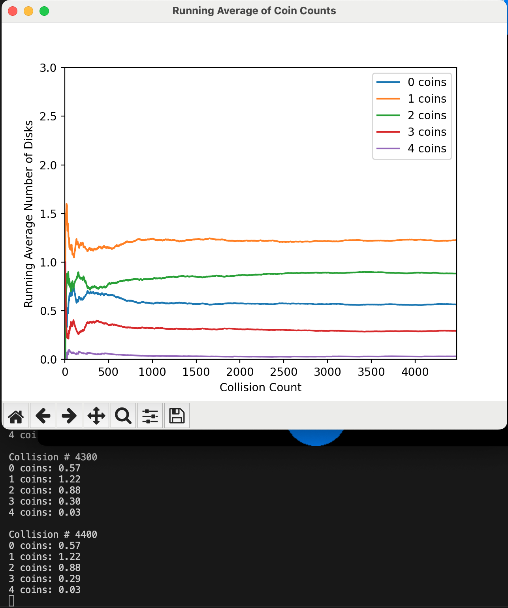

# Symmetrical Interaction Algorithm

This document describes the **Symmetrical Interaction Algorithm** used in the simulation. Unlike the original asymmetrical approach, this algorithm ensures that the coin exchange between two disks is processed simultaneously, eliminating the order dependency. However, as shown in the results, this approach still deviates from the theoretical Boltzmann distribution, particularly in the dominance of `n(E_1)` over `n(E_0)`.

---

## Interaction Logic

### Key Steps:
1. **Calculate all coin movements first**:  
   - Determine how many coins will move from Disk1 to Disk2.  
   - Determine how many coins will move from Disk2 to Disk1.  

2. **Apply the changes simultaneously**:  
   - Update the coin counts for both disks at the same time.  

This ensures that the exchange is fair and independent of the order in which disks are processed.

---

## Code Snippet: Symmetrical Implementation

```python
# --- Coin exchange (updated symmetrical version) ---
# Calculate coins moving from disk1 to disk2
coins_moving_to_disk2 = 0
for _ in range(disk1.coin_count):
    if random.random() < 0.5:
        coins_moving_to_disk2 += 1

# Calculate coins moving from disk2 to disk1
coins_moving_to_disk1 = 0
for _ in range(disk2.coin_count):
    if random.random() < 0.5:
        coins_moving_to_disk1 += 1

# Apply the changes simultaneously
disk1.coin_count = disk1.coin_count - coins_moving_to_disk2 + coins_moving_to_disk1
disk2.coin_count = disk2.coin_count - coins_moving_to_disk1 + coins_moving_to_disk2
```

---

## Why This is Symmetrical

- **No Order Dependency**:  
  The number of coins moving from Disk1 to Disk2 and from Disk2 to Disk1 is calculated **before** any changes are applied.  
  Example:  
  - Disk1 starts with 2 coins, Disk2 with 0.  
  - If Disk1 is determined to transfer 1 coin to Disk2, and Disk2 is determined to transfer 0 coins to Disk1, the changes are applied simultaneously.  

- **Physical Realism**:  
  The exchange is now independent of the order in which disks are processed, making the simulation more physically accurate.

---

## Example: 3 Disks and 4 Coins

### Theoretical Results
For a system with **3 disks** and **4 coins**, the expected average number of disks with each energy level (`n(E_i)`) is:
- `n(E_0) ≈ 1.0`
- `n(E_1) ≈ 0.8`
- `n(E_2) ≈ 0.6`
- `n(E_3) ≈ 0.4`
- `n(E_4) ≈ 0.2`

These values are derived from the Boltzmann distribution and represent the equilibrium state of the system.

---

### Simulation Results
The simulation using the **Symmetrical Interaction Algorithm** does not fully align with the theoretical predictions. Below is a plot showing the convergence of the simulation over time:



#### Key Observations:
- **Deviation from Theory**: The simulation does not converge to the expected Boltzmann distribution. Specifically:
  - `n(E_1)` dominates, becoming the largest value, while `n(E_0)` is smaller than expected.
  - This suggests that the symmetrical algorithm still introduces some bias in the energy exchange process.

#### Example Output:
At **Collision # 4400**, the average number of disks with each energy level is:
- `0 coins: 0.57`
- `1 coins: 1.22`
- `2 coins: 0.88`
- `3 coins: 0.29`
- `4 coins: 0.03`

These results show that `n(E_1)` is significantly larger than `n(E_0)`, which contradicts the theoretical prediction that `n(E_0)` should be the largest.

---

## Summary of Key Features

| Feature | Description |
|---------|-------------|
| **No Order Dependency** | The outcome is independent of disk processing order. |
| **Physical Realism** | More realistic than the asymmetrical approach but still deviates from theory. |
| **Convergence** | Does not fully align with the Boltzmann distribution. |

---

## Comparison with Theoretical Values

| Energy Level | Theoretical (`n(E_i)`) | Simulation (`n(E_i)`) | Deviation |
|--------------|------------------------|-----------------------|-----------|
| `E_0`        | 1.0                    | 0.57                  | -0.43     |
| `E_1`        | 0.8                    | 1.22                  | +0.42     |
| `E_2`        | 0.6                    | 0.88                  | +0.28     |
| `E_3`        | 0.4                    | 0.29                  | -0.11     |
| `E_4`        | 0.2                    | 0.03                  | -0.17     |

---

## Conclusion

While the **Symmetrical Interaction Algorithm** eliminates the order dependency present in the original asymmetrical approach, it still fails to produce the correct Boltzmann distribution. The dominance of `n(E_1)` over `n(E_0)` highlights the need for a more robust exchange mechanism, such as the **Uniform Probability Redistribution Algorithm**, which aligns closely with theoretical predictions.
```
